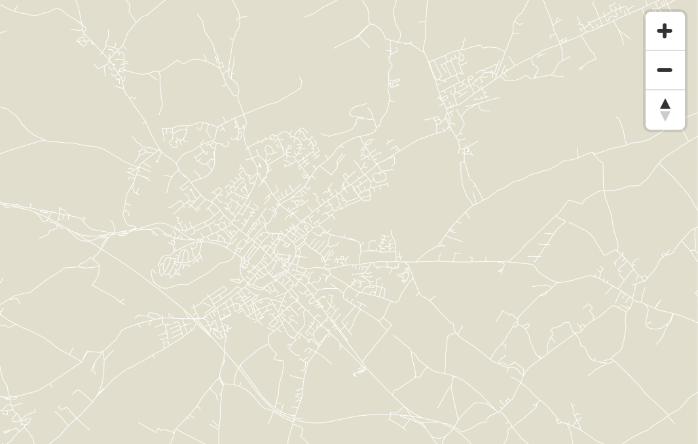

# Static vector tile serving

Code for running static vector tile hosting for online maps as described in https://geovation.github.io/build-your-own-static-vector-tile-pipeline 

## Getting Started

These instructions will get you a copy of the project up and running on your local machine for development and testing purposes.

### Prerequisites

What things you need to install the software and how to install them

MacOS:

```
brew install gdal tippecanoe
brew install node
```

### Installing

A step by step series of examples that tell you how to get a development env running

```
make
```

This sets up the dataset, starts up server for serving the vector tiles and opens browser which shows the map.
It might take a moment for the browser to show the actual roads. Trigger loading the tiles by zooming in/out a little bit.


